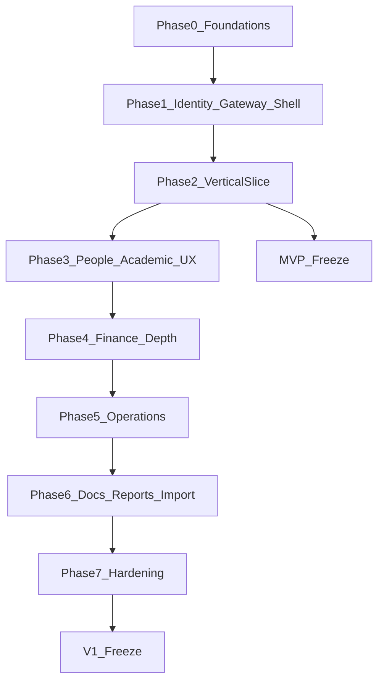

# 11 — MVP & v1 Step-by-Step Development

**Document purpose:** Authoritative, testable development roadmap from empty repo to MVP freeze, then to full v1.  
**Status:** Active — follow this document for build order.  
**Companions:** [01](./01-modules-and-delivery-plan.md) (architecture/modules), [02](./02-coding-standards-and-guidelines.md) (DoD), [03](./03-functional-requirements.md)–[10](./10-reporting-requirements.md), [ADRs](./adr/)

---

## 1. Purpose & how to use

- Complete steps **in order**. Do not start a step until the previous step’s **exit criteria** pass.
- Every step is independently demoable and testable.
- **Definition of Done** for each step = this document’s exit criteria **plus** [02-coding-standards-and-guidelines.md](./02-coding-standards-and-guidelines.md) §17 (Gateway+JWT, audits, OpenAPI, tenant isolation, responsive UI when UI is in scope).
- Prefer: unit → module integration (Testcontainers + MySQL) → API via Gateway → UI e2e (incl. viewports 375 / 768 / 1440).

---

## 2. Locked decisions (do not re-litigate during build)

| Topic | Decision | ADR |
| --- | --- | --- |
| Shape | Modular monolith + API Gateway | [0001](./adr/0001-modular-monolith.md) |
| Database | One MySQL DB; module-owned tables; no cross-module FKs | [0002](./adr/0002-database-strategy.md) |
| Auth | JWT + refresh; Identity module | [0003](./adr/0003-authentication.md) |
| Tenancy | Multi-tenant from day one (`institute_id`) | [0004](./adr/0004-multi-tenancy.md) |
| Product | Professional training / coaching institute | [0005](./adr/0005-institute-type.md) |

---

## 3. MVP vs v1 — scope freeze

### 3.1 Definitions

| Release | Meaning |
| --- | --- |
| **MVP** | Phases **0–2** complete. Stakeholders can run the fee spine on a real (or demo) institute, with proven **two-tenant isolation**. |
| **v1** | MVP + Phases **3–7**. Full agreed coaching-institute product for production readiness. |
| **Post-v1** | Phase **8** (extract modules / message broker) — not required to call v1 done. |

### 3.2 Feature matrix

| Capability | MVP | v1 |
| --- | :---: | :---: |
| Repo, Compose, Flyway, TenantContext | Yes | Yes |
| PLATFORM_ADMIN create/suspend institute | Yes | Yes |
| Login / JWT / RBAC basics | Yes | Yes |
| Responsive shell + design system | Yes | Yes |
| Student CRUD (+ guardians, addresses) | Yes | Yes (expanded UX) |
| Course, fee catalog + categories, batch | Yes | Yes (expanded UX) |
| Admission approve → student link | Yes (minimal path) | Yes (full enquiry/UX) |
| Enroll → fee account + invoices (idempotent) | Yes | Yes |
| Collect payment + receipt + outstanding | Yes | Yes |
| Cross-tenant isolation tests | Yes | Yes (regress) |
| Enrollment transfer / withdraw / capacity override | — | Yes |
| Document upload (pre-signed) | — | Yes |
| Refunds, adjustments, aging, FY reports | — | Yes |
| Attendance / timetable / exams | — | Yes |
| Certificates (beyond payment receipt) | — | Yes |
| CSV import/export, ★ report screens | — | Yes |
| Notification email MVP | — | Yes (Phase 7) |
| Hardening (security, DR, perf, responsive QA) | Partial (slice) | Yes (full) |
| Microservice extraction / Kafka | — | — (post-v1) |

### 3.3 Dependency flow



---

# PART A — MVP (Phases 0–2)

---

## Phase 0 — Foundations

### Step 0.1 — Monorepo skeleton

| | |
| --- | --- |
| **Goal** | Empty but buildable layout for monolith + gateway + Angular |
| **Deliverables** | Folders: `ims-ui/`, `ims-api/ims-application/`, `ims-api/api-gateway/`, `ims-api/ims-common/`, `infra/`, `docs/`, `postman/`; root README with how to build |
| **FR/BR** | — |
| **Test plan** | CI or local: backend modules compile; `ng` version check / empty app builds |
| **Exit criteria** | Fresh clone builds skeleton without domain code |

### Step 0.2 — Local infrastructure

| | |
| --- | --- |
| **Goal** | Shared local deps for all later steps |
| **Deliverables** | `docker-compose` with MySQL 8, MinIO, Jaeger; documented ports; healthchecks |
| **Test plan** | `compose up`; MySQL accepts connections; Jaeger UI loads; MinIO console reachable |
| **Exit criteria** | One documented command brings stack up on Windows/Linux |

### Step 0.3 — Standards & ArchUnit stub

| | |
| --- | --- |
| **Goal** | Enforce modular boundaries from day one |
| **Deliverables** | Docs/ADRs treated as accepted; ArchUnit (or equivalent) stub failing if `finance` imports `people` persistence |
| **Test plan** | ArchUnit suite runs in CI placeholder |
| **Exit criteria** | Illegal module dependency fails the build |

### Step 0.4 — Thin `ims-common`

| | |
| --- | --- |
| **Goal** | Shared error shape, tracing helpers, page DTO, TenantContext holder API |
| **Deliverables** | Library module; `CorrelationIds`; no domain entities/DTOs |
| **FR/BR** | Doc 07 error contract |
| **Test plan** | Unit tests for error serialization / money scale helper if present |
| **Exit criteria** | Consumable from `ims-application` and gateway |

### Step 0.5 — Flyway baseline + tenant conventions

| | |
| --- | --- |
| **Goal** | Schema foundation for multi-tenancy and cross-cutting tables |
| **Deliverables** | `institutes`; `audit_logs`; `idempotency_records`; documented rule: every future business table has `institute_id`; seed **two** demo institutes (`DEMO_A`, `DEMO_B`) |
| **FR/BR** | FR-TN-*; BR-TN-*; ADR 0004 |
| **Test plan** | Migrate on empty DB; migrate again (idempotent); assert seed institute count = 2 |
| **Exit criteria** | Second migrate is no-op; conventions documented in migration README |

### Step 0.6 — TenantContext + isolation harness

| | |
| --- | --- |
| **Goal** | No unscoped data access pattern ships later |
| **Deliverables** | TenantContext from security; repository filter strategy (Hibernate filter / aspect / mandatory `instituteId`); sample entity + isolation test |
| **FR/BR** | BR-TN-01–03; FR-TN-02–06 |
| **Test plan** | Insert row for institute A; with TenantContext=B, `findById` returns empty / 404 path |
| **Exit criteria** | Isolation harness green; pattern copied by later modules |

---

## Phase 1 — Identity, Gateway, Angular shell

### Step 1.1 — Identity schema & seeds

| | |
| --- | --- |
| **Goal** | Users/roles/permissions per institute |
| **Deliverables** | Flyway: `users` (with `institute_id`), roles, permissions, user_roles, refresh_tokens, login_audit; seed PLATFORM_ADMIN; seed ADMIN users for DEMO_A and DEMO_B |
| **FR/BR** | FR-ID-*; FR-TN-01; doc 06 |
| **Test plan** | Unique `(institute_id, username)`; platform user has null institute |
| **Exit criteria** | Seeds login-ready |

### Step 1.2 — Auth APIs

| | |
| --- | --- |
| **Goal** | Login/refresh/logout/me |
| **Deliverables** | JWT access (claims: `sub`, roles/permissions, **`institute_id`**); refresh; password hash; login audit |
| **FR/BR** | FR-ID-01–02, FR-ID-06; ADR 0003/0004 |
| **Test plan** | Success/fail login; refresh; locked user; JWT contains institute_id for institute users |
| **Exit criteria** | OpenAPI for auth published; ≥ critical path tests green |

### Step 1.3 — Institute platform APIs

| | |
| --- | --- |
| **Goal** | PLATFORM_ADMIN can create/suspend institutes |
| **Deliverables** | Create/list/suspend/update; contact profile (mobile, admin email, website, address, icon URL); list (platform / own) |
| **FR/BR** | FR-TN-01; BR-TN-05 |
| **Test plan** | Institute ADMIN cannot create institute; PLATFORM_ADMIN can; profile fields round-trip |
| **Exit criteria** | Authz tests green |

### Step 1.4 — API Gateway + tracing

| | |
| --- | --- |
| **Goal** | Single entry; traces and logs correlate |
| **Deliverables** | Routes `/api/v1/**` → app; CORS; strip spoofed tenant headers; W3C `traceparent` + `X-Request-Id`; rate-limit login; access logs with `traceId`/`spanId`/`requestId` on gateway **and** app |
| **FR/BR** | Doc 07 §6; doc 09 §6; doc 02 §5.7 |
| **Test plan** | Login via gateway; both consoles show matching `traceId`; Jaeger shows gateway → app spans |
| **Exit criteria** | Happy path does not require hitting app port directly; one `traceId` ties gateway + app logs |

**Logging/tracing status (2026-08-09):** Implemented — shared console MDC pattern; `RequestLoggingGlobalFilter` / `RequestLoggingFilter`; `CorrelationIds`; OTLP to Jaeger; login/institute/student activity logs.
### Step 1.5 — Angular auth + responsive shell

| | |
| --- | --- |
| **Goal** | SPA can authenticate and navigate shell on all breakpoints |
| **Deliverables** | Angular app (21 until Node ≥22.22.3 enables Angular 22); login; interceptor; guards; layout (sidebar ↔ drawer); environments pointing at gateway |
| **FR/BR** | FR-UX-01 |
| **Test plan** | Unit auth service; manual login; viewport smoke 375 / 768 / 1440 — no page-level horizontal scroll |
| **Exit criteria** | Authenticated empty dashboard; unauthenticated → login; shell OK on three widths |

### Step 1.6 — Design system + UX states

| | |
| --- | --- |
| **Goal** | Feature teams reuse primitives |
| **Deliverables** | Shared: Button, Input, Select, DatePicker, Modal/Drawer, Table, Card, Empty/Loading/Error, Toast, Pagination, responsive data view |
| **FR/BR** | FR-UX-02, FR-UX-04 |
| **Test plan** | Demo route showing each primitive; component tests for Empty/Error |
| **Exit criteria** | Checklist in PR template: “used design system” |

### Step 1.7 — Accessibility baseline

| | |
| --- | --- |
| **Goal** | WCAG 2.2 AA start on shell/login |
| **Deliverables** | Labels, focus order, modal focus trap pattern, contrast tokens |
| **FR/BR** | FR-UX-03 |
| **Test plan** | Keyboard-only login + open drawer |
| **Exit criteria** | A11y checklist signed for shell/login |

**Phase 1 exit (gate to Phase 2):** Two demo institutes; ADMIN can log in via gateway for each; shell responsive; TenantContext ready.

**Phase 1 status (2026-08-09):** **Closed.** Gate met — gateway login for `DEMO_A`/`DEMO_B`; UI → `:8088`; design-system `/design-system`; a11y signed. Angular remains **21** until Node ≥22.22.3. Deferred polish: real-phone LAN access, responsive smoke checkboxes. **Logging/tracing:** access logs + shared `traceId`/`spanId`/`requestId` across gateway and app; Jaeger OTLP wired (manual verify in UI).

**Phase 2.1 status:** Complete — students + guardians + addresses (API + minimal UI list/create).

**Phase 2.2 status:** Complete — academic years, fee categories, courses, fee plans/installments (BR-FI-01), batches (API + minimal UI Courses/Batches).

**Phase 2.3–2.5 status:** Complete — admissions approve/reject; enroll + activate → fee account/invoices; payments with oldest-due allocation + receipts + idempotency.

**Phase 2.6 status:** Complete (minimal) — Admissions, Enroll, Outstanding UI wired; Playwright e2e deferred as polish.

**Phase 2.7 status:** Complete — `AuditService` records STUDENT_CREATED, ADMISSION_APPROVED, ENROLLMENT_ACTIVATED, PAYMENT_SUCCESS.

**Phase 2.8 status:** Complete — `SliceIsolationIT` for student/course cross-tenant 404 (+ same code allowed across tenants).

**Phase 3.1 status:** Complete — faculty/staff CRUD; student/faculty/staff list search + status filter + pagination; role-gated nav (permission-aware). Manual sample seed: `ims-api/scripts/seed-demo-people-pagination.sql` (not Flyway).

**Phase 3.2 status:** Complete — enrollment lifecycle APIs + detail UX: cancel / activate (admission waiver + capacity override) / suspend / resume / withdraw / complete / transfer (same course). Audits: `ENROLLMENT_*`, `CAPACITY_OVERRIDE`, `ADMISSION_WAIVER`. Flyway `V11__enrollment_lifecycle.sql`.

**Users & roles status:** Complete — institute ADMIN (`user:manage`) can list/create/edit/activate/deactivate login users and assign roles via `/api/v1/users`, `/api/v1/roles` + UI **Users & roles**. Distinct from Staff master data. Cannot assign `PLATFORM_ADMIN`; cannot deactivate self or remove the last ACTIVE ADMIN.

**Phase 3.3 status:** Complete — optional enquiries (`/api/v1/enquiries` OPEN→CONVERTED/CLOSED); application list search/status/paging; cancel + approve/reject on detail (reason min 5 for reject/cancel); FRONT_DESK `enrollment:write` to enroll without course catalog rights. Flyway `V12__admissions_enquiry.sql`. Re-login after V12 for new JWT permissions.

**Phase 3.4 status:** Complete — `person_documents` metadata; MinIO pre-signed PUT/GET (`institutes/{id}/…`); type/size rules (PDF/JPEG/PNG, 5 MB); ADMIN/FRONT_DESK `document:write`, coordinators/accountant `document:read`. UI on student/faculty/staff detail. Flyway `V13__person_documents.sql`. Re-login after V13 for new JWT permissions. Start MinIO (`infra` compose) before uploading.

**Business codes:** Sequence-backed auto-generation (`code_sequences` + `GET /api/v1/codes/next?type=…`). Codes optional on create (blank → auto); UI Generate button. Formats: student `{instituteId}{seq:06}` → `1000001`; course `C{I}-{seq:05}`; fee plan `P{I}-…`; batch `B{I}-…`; year `AY{I}-…`; fee category `FC{I}-…`; admission `A{I}-{seq:06}`; faculty `F{I}-{seq:05}`; staff `S{I}-{seq:05}`; institute `I{seq:05}` (platform).

**View / edit UI:** List rows include View/Edit where APIs allow. Students, courses, batches, fee plans, institutes support edit of mutable fields (codes immutable). Admissions are view + workflow (approve/reject/cancel); enrollments are view + lifecycle. Enquiries convert to applications.

---

## Phase 2 — Vertical slice (MVP business value)

Spine:

```text
Login → Create Student → Create Course + Fee Plan → Batch
  → Admission approve (or ADMIN waiver) → Enroll / Activate
  → Fee account + invoices → Collect payment + Receipt
  → View outstanding
```

### Step 2.1 — People: students (+ guardians, addresses)

| | |
| --- | --- |
| **Goal** | Tenant-scoped student master data |
| **Deliverables** | Tables + APIs: students, guardians M:N, student_addresses; unique `(institute_id, student_code)`; authz per doc 06 |
| **FR/BR** | FR-PE-01–04, FR-PE-06; BR-PE-*; BR-TN-* |
| **Test plan** | CRUD; soft-deactivate; guardian shared by two students; cross-tenant IDOR on student id |
| **Exit criteria** | Integration + authz + isolation tests green |

### Step 2.2 — Academic: course, fee plan, batch

| | |
| --- | --- |
| **Goal** | Catalog ready for enrollment |
| **Deliverables** | departments (optional minimal), courses, fee_categories, course_fee_plans + installments, batches, academic_year (minimal); installment sum = plan total |
| **FR/BR** | FR-AC-01–03; BR-FI-01 |
| **Test plan** | Invalid installment sum rejected; codes unique per institute |
| **Exit criteria** | Can create ACTIVE course + default fee plan + batch with capacity |
| **How it fits** | See [12 — Course, fee structure & relationships](./12-course-fee-structure-and-relationships.md) |

### Step 2.3 — Admissions (minimal approve path)

| | |
| --- | --- |
| **Goal** | Admission is first-class; do not overload enrollment status |
| **Deliverables** | `admission_applications` statuses; approve → link/create student; ADMIN waiver path documented for slice if needed |
| **FR/BR** | FR-AD-02–04; BR-AD-* |
| **Test plan** | Approve/reject with reason; duplicate active application blocked per institute |
| **Exit criteria** | Approved application yields usable student for enrollment |

### Step 2.4 — Enrollment activate → finance invoices

| | |
| --- | --- |
| **Goal** | Enrollment activation creates fee account + invoices idempotently |
| **Deliverables** | enrollments; activate use case; finance `student_fee_accounts` + invoices (categories, financial_year); `Idempotency-Key`; outstanding snapshot = invoice total |
| **FR/BR** | FR-AC-04; FR-FI-01; BR-EN-05; BR-FI-08–09; BR-TN-* |
| **Test plan** | Activate twice with same key → one account; outstanding equals sum; capacity enforced |
| **Exit criteria** | Ledger ready for payment; OpenAPI updated |

### Step 2.5 — Payment, allocation, receipt, concurrency

| | |
| --- | --- |
| **Goal** | Collect money safely |
| **Deliverables** | payments, payment_allocations, receipts; oldest-due allocation; optimistic lock on fee account; reverse not required for MVP |
| **FR/BR** | FR-FI-02–04, FR-FI-09; BR-FI-02–05, BR-FI-08–09 |
| **Test plan** | Partial → PARTIAL; full → PAID outstanding 0; concurrent two payments; idempotent collect |
| **Exit criteria** | Receipt number issued; finance_audit/audit_logs for payment |

### Step 2.6 — Angular vertical-slice UI

| | |
| --- | --- |
| **Goal** | Demo spine entirely in UI |
| **Deliverables** | Screens: student create/list, course/fee plan/batch, admission approve (minimal), enroll, collect payment, outstanding list; UX states on each |
| **FR/BR** | FR-UX-*; responsive § |
| **Test plan** | Playwright e2e spine; viewports 375 / 768 / 1440 on list + payment |
| **Exit criteria** | Non-dev can complete spine on laptop and mobile shell |

### Step 2.7 — Audit coverage for slice

| | |
| --- | --- |
| **Goal** | Business-critical slice actions audited |
| **Deliverables** | Audits for student create, admission approve, enrollment activate, payment success |
| **FR/BR** | BR-AU-*; doc 08 |
| **Test plan** | Assert audit rows with institute_id, actor, before/after where applicable |
| **Exit criteria** | Audit assertions in integration suite |

### Step 2.8 — Multi-tenant isolation on slice APIs

| | |
| --- | --- |
| **Goal** | MVP security gate |
| **Deliverables** | Seeded parallel data in DEMO_A / DEMO_B; isolation test suite for student, course, enrollment, payment, outstanding |
| **FR/BR** | FR-TN-06; BR-TN-03 |
| **Test plan** | Token A + resource id from B → 404; codes collide across tenants allowed; same code within tenant rejected |
| **Exit criteria** | Isolation suite mandatory in CI |

---

## MVP freeze checklist

- [x] Phases 0–2 exit criteria all green *(manual demo + Docker IT when available)*
- [ ] Demo script (§8) completed on DEMO_A  
- [x] Isolation suite green for DEMO_A vs DEMO_B *(SliceIsolationIT; runs when Docker available)*  
- [x] OpenAPI for MVP endpoints published  
- [x] Known limitations listed (no refunds, no attendance, etc.)  

**After MVP freeze:** start Phase 3; do not expand scope backward into MVP unless fixing defects.

### Deferred / park for later (not Phase 3 blockers)

Parked **2026-08-09** so Phase 3 can proceed. Revisit before calling MVP “stakeholder-frozen.”

| Item | Origin | Notes |
| --- | --- | --- |
| §8 demo script on `DEMO_A` (+ isolation glance on `DEMO_B`) | MVP freeze | Manual stakeholder walkthrough |
| Playwright e2e for fee spine | Step 2.6 | Deferred polish |
| Responsive smoke checkboxes (375 / 768 / 1440) | Phase 1 | `docs/design/responsive-phase1-smoke.md` still ☐ |
| Real-phone LAN access verify | Phase 1 | `docs/design/mobile-localhost-access.md` |
| Manual Jaeger + login rate-limit proof | Step 1.4 | OTLP wired; UI verify pending |
| Angular 22 upgrade | Phase 1 | Blocked until Node ≥ 22.22.3 |

---

# PART B — v1 (Phases 3–7)

---

## Phase 3 — Expand People / Academic / Admissions UX

### Step 3.0 — Institute users & roles (identity ops)

| | |
| --- | --- |
| **Goal** | ADMIN can provision login accounts with roles (not Staff master data) |
| **Deliverables** | `GET/POST /api/v1/users`, `PUT /users/{id}`, activate/deactivate; `GET /api/v1/roles`; Angular Users & roles UI + nav (`user:manage`) |
| **FR/BR** | FR-ID-*; doc 06 Manage users/roles |
| **Test plan** | Create FRONT_DESK user; login; cannot assign PLATFORM_ADMIN; cannot deactivate self; last ADMIN protected |
| **Exit criteria** | Institute staffed without SQL seeds beyond initial ADMIN |
| **Status** | **Complete** |

### Step 3.1 — Student & faculty list/search UX

| | |
| --- | --- |
| **Goal** | Production-usable people management |
| **Deliverables** | Search/filter/paging; faculty CRUD; staff minimal; role-gated UI |
| **FR/BR** | FR-PE-*; RP-ST-01 |
| **Test plan** | e2e search; STUDENT cannot list all |
| **Exit criteria** | FRONT_DESK/ADMIN workflows comfortable on tablet |

### Step 3.2 — Enrollment lifecycle UX + rules

| | |
| --- | --- |
| **Goal** | Transfer, withdraw, suspend, complete, capacity override |
| **Deliverables** | APIs + UI; audited capacity override; transfer same course (BR-TR-*) |
| **FR/BR** | FR-AC-05–08; BR-EN-*; BR-TR-* |
| **Test plan** | Second active enrollment same course blocked; override requires ADMIN + reason |
| **Exit criteria** | Lifecycle transitions match doc 04 state diagram |

### Step 3.3 — Admissions full UX + enquiry

| | |
| --- | --- |
| **Goal** | Front-desk admission process |
| **Deliverables** | Enquiry optional; application list; approve/reject UI; reasons |
| **FR/BR** | FR-AD-01–05; BR-AD-*; RP-ST-03 |
| **Test plan** | e2e enquiry → application → approve |
| **Exit criteria** | FRONT_DESK path without SQL seeds |
| **Status** | **Complete** |

### Step 3.4 — Person documents (pre-signed upload)

| | |
| --- | --- |
| **Goal** | Private identity docs |
| **Deliverables** | Metadata table; MinIO paths `institutes/{id}/...`; pre-signed upload/download; type/size rules |
| **FR/BR** | FR-PE-05; BR-DC-*; doc 08 |
| **Test plan** | Cross-tenant download denied; oversized rejected |
| **Exit criteria** | Upload+download works for ADMIN/FRONT_DESK |
| **Status** | **Complete** |

### Step 3.5 — Faculty–batch assignment UI

| | |
| --- | --- |
| **Goal** | Teaching assignments visible |
| **Deliverables** | Assign faculty to batch/subject; list on batch detail |
| **FR/BR** | FR-AC-07 |
| **Test plan** | API + UI |
| **Exit criteria** | Assignment visible; prepares Phase 5 authz |

---

## Phase 4 — Finance depth

### Step 4.1 — Adjustments (discount / scholarship / waiver / penalty)

| | |
| --- | --- |
| **Goal** | Non-payment ledger changes |
| **Deliverables** | fee_adjustments APIs; outstanding recalc; audit |
| **FR/BR** | FR-FI-05; outstanding formula doc 04 |
| **Test plan** | Waiver decreases; penalty increases; unauthorized role rejected |
| **Exit criteria** | Statement reflects adjustments |

### Step 4.2 — Refund lifecycle

| | |
| --- | --- |
| **Goal** | Full refund state machine |
| **Deliverables** | refund_requests; approve/process; idempotency; outstanding update |
| **FR/BR** | FR-FI-06; BR-RF-* |
| **Test plan** | Amount caps; FAILED leaves ledger unchanged |
| **Exit criteria** | RP-FI-06 exportable list |

### Step 4.3 — Payment reversal

| | |
| --- | --- |
| **Goal** | Correct mistaken payments |
| **Deliverables** | Reverse payment; release allocations; cancel/supersede receipt |
| **FR/BR** | FR-FI-07; BR-PV-* |
| **Test plan** | Outstanding restored; no hard delete of payment row |
| **Exit criteria** | Audit trail complete |

### Step 4.4 — Aging outstanding + financial year + category reports

| | |
| --- | --- |
| **Goal** | Accountant operations |
| **Deliverables** | Aging buckets; FY stamping; collection by category/method; daily collection |
| **FR/BR** | FR-FI-08; RP-FI-01–05, RP-FI-08 |
| **Test plan** | Report totals match ledger sample |
| **Exit criteria** | ★ finance reports available as screen and/or CSV |

### Step 4.5 — Fee statement PDF

| | |
| --- | --- |
| **Goal** | Student/accountant printable statement |
| **Deliverables** | Statement API + PDF; student self-access |
| **FR/BR** | FR-FI-04; RP-FI-05; FR-DC-01 |
| **Test plan** | Authz self vs other; totals match |
| **Exit criteria** | Downloadable statement for own account |

---

## Phase 5 — Operations

### Step 5.1 — Attendance lifecycle

| | |
| --- | --- |
| **Goal** | Mark and lock attendance |
| **Deliverables** | sessions DRAFT→SUBMITTED→LOCKED; records; % rules (LATE present; EXCUSED excluded denominator); faculty assigned-only |
| **FR/BR** | FR-AT-*; BR-AT-*; RP-AT-* |
| **Test plan** | Edit rules; unlock audited; mid-course joiner |
| **Exit criteria** | Faculty can mark on tablet; % API correct |

### Step 5.2 — Timetable

| | |
| --- | --- |
| **Goal** | Weekly schedule without conflicts |
| **Deliverables** | rooms; slots; room/faculty conflict detection; responsive day/agenda vs week |
| **FR/BR** | FR-TT-01 |
| **Test plan** | Overlap rejected |
| **Exit criteria** | Batch timetable renders laptop + mobile |

### Step 5.3 — Exams & results

| | |
| --- | --- |
| **Goal** | Components, publish, lock |
| **Deliverables** | exams, exam_components, results, component marks; ABSENT/WITHHELD; student sees published only |
| **FR/BR** | FR-EX-*; BR-EX-*; RP-EX-01 |
| **Test plan** | Draft hidden from student; publish visible; lock blocks edit |
| **Exit criteria** | Marks entry + publish path demoable |

### Step 5.4 — Operations Angular UI

| | |
| --- | --- |
| **Goal** | Attendance, timetable, exams screens |
| **Deliverables** | Role-based UI; UX states; responsive |
| **Test plan** | e2e smoke + viewports |
| **Exit criteria** | Operations demo path complete |

---

## Phase 6 — Documents, import/export, ★ reports

### Step 6.1 — Certificates (minimal set)

| | |
| --- | --- |
| **Goal** | Bonafide / completion beyond fee receipt |
| **Deliverables** | Templates; generate/store PDF under tenant prefix |
| **FR/BR** | FR-DC-02–03 |
| **Test plan** | Authz; tenant path |
| **Exit criteria** | At least one certificate type downloadable |

### Step 6.2 — CSV import students (+ faculty)

| | |
| --- | --- |
| **Goal** | Bulk onboarding |
| **Deliverables** | Validate then insert; error report file; tenant-scoped |
| **FR/BR** | FR-IE-01; doc 10 import |
| **Test plan** | Bad rows reported; good rows inserted; no cross-tenant |
| **Exit criteria** | Import usable by ADMIN |

### Step 6.3 — Bulk marks upload

| | |
| --- | --- |
| **Goal** | Async-friendly marks import |
| **Deliverables** | Job for large files; idempotent per exam+student |
| **FR/BR** | FR-IE-02 |
| **Test plan** | Re-upload same file safe |
| **Exit criteria** | Documented job status API/UI |

### Step 6.4 — ★ Report screens & exports

| | |
| --- | --- |
| **Goal** | Cover starred reports in doc 10 |
| **Deliverables** | Student/admission/finance/attendance ★ reports as UI and/or CSV |
| **FR/BR** | FR-RP-01; RP-* ★ |
| **Test plan** | Spot-check totals vs known fixture |
| **Exit criteria** | All ★ rows in doc 10 marked available |

### Step 6.5 — Withdrawal / roster reports

| | |
| --- | --- |
| **Goal** | RP-ST-04, RP-ST-05 |
| **Deliverables** | Filters + export |
| **Test plan** | Matches enrollment statuses |
| **Exit criteria** | Coordinator can export roster |

---

## Phase 7 — Hardening (v1 production gate)

### Step 7.1 — Security pass

| | |
| --- | --- |
| **Goal** | Close authz/PII/dependency gaps |
| **Deliverables** | OWASP-oriented checklist; dependency scan; rate limits reviewed; secrets audit |
| **FR/BR** | Doc 08 |
| **Test plan** | Isolation regression; permission matrix spot checks |
| **Exit criteria** | Critical vulns = 0; checklist filed |

### Step 7.2 — Backup / DR drill doc

| | |
| --- | --- |
| **Goal** | Operable backups |
| **Deliverables** | Documented backup/restore for MySQL + MinIO; one restore drill recorded |
| **FR/BR** | Doc 09 |
| **Test plan** | Restore to scratch env succeeds |
| **Exit criteria** | RPO/RTO notes accepted |

### Step 7.3 — Performance baseline

| | |
| --- | --- |
| **Goal** | Know p95 for key reads |
| **Deliverables** | Indexes verified; k6/JMeter smoke on login, outstanding list, student search |
| **Test plan** | Targets recorded under `/docs/perf` (or agreed path) |
| **Exit criteria** | Baseline report stored |

### Step 7.4 — Full responsive QA matrix

| | |
| --- | --- |
| **Goal** | All v1 screens at three breakpoints |
| **Deliverables** | Matrix module × {375, 768, 1440}; fix P0/P1 |
| **FR/BR** | FR-UX-01; doc 01 §3.13 |
| **Test plan** | Playwright projects + manual for timetable/exams |
| **Exit criteria** | `/docs/responsive-qa.md` signed off |

### Step 7.5 — OpenAPI / contract gate in CI

| | |
| --- | --- |
| **Goal** | No silent API breaks |
| **Deliverables** | CI fails on breaking OpenAPI drift without version bump |
| **FR/BR** | Doc 07 |
| **Test plan** | Intentional break fails CI |
| **Exit criteria** | Gate enabled on main |

### Step 7.6 — Notification email MVP

| | |
| --- | --- |
| **Goal** | Channel-abstract email for key triggers |
| **Deliverables** | Templates + delivery log; triggers: admission approved, payment received (others optional) |
| **FR/BR** | FR-NT-*; BR-NT-* |
| **Test plan** | Fake/smtp sink; retry recorded |
| **Exit criteria** | At least two triggers deliver in local/staging |

---

## v1 freeze checklist

- [ ] Phases 3–7 exit criteria green  
- [ ] MVP regression (spine + isolation) still green  
- [ ] ★ reports available  
- [ ] Authz matrix capabilities implemented for shipped screens  
- [ ] Responsive QA signed  
- [ ] Security + DR + perf baselines stored  
- [ ] OpenAPI gate on  
- [ ] Post-v1 Phase 8 explicitly **not** blocking release  

---

## Phase 8 — Post-v1 (not part of v1)

| Step | Focus |
| --- | --- |
| 8.1 | Extract a module only with new ADR (likely finance/notification/reporting) |
| 8.2 | External broker + outbox consumers if async volume requires it |

---

## 7. Suggested sequential order (checklist)

Use as a build board; do not skip gates.

**MVP**

- [ ] 0.1 → 0.2 → 0.3 → 0.4 → 0.5 → 0.6  
- [ ] 1.1 → 1.2 → 1.3 → 1.4 → 1.5 → 1.6 → 1.7  
- [ ] 2.1 → 2.2 → 2.3 → 2.4 → 2.5 → 2.6 → 2.7 → 2.8  
- [ ] **MVP freeze**  

**v1**

- [ ] **3.0** → 3.1 → 3.2 → 3.3 → 3.4 → 3.5  
- [ ] 4.1 → 4.2 → 4.3 → 4.4 → 4.5  
- [ ] 5.1 → 5.2 → 5.3 → 5.4  
- [ ] 6.1 → 6.2 → 6.3 → 6.4 → 6.5  
- [ ] 7.1 → 7.2 → 7.3 → 7.4 → 7.5 → 7.6  
- [ ] **v1 freeze**  

---

## 8. MVP demo script (stakeholder)

Environment: Gateway + app + MySQL; browsers at laptop and phone width.

1. PLATFORM_ADMIN shows DEMO_A and DEMO_B exist (or create a third institute).  
2. Log in as DEMO_A ADMIN.  
3. Create student (with guardian).  
4. Create course → fee plan (category + installments) → batch.  
5. Create/approve admission (or waiver) → enroll & activate.  
6. Show invoices and outstanding = total.  
7. Collect partial payment → receipt number → outstanding decreased.  
8. Collect remaining → outstanding zero.  
9. Log in as DEMO_B ADMIN; show DEMO_A student id returns not found / empty.  
10. Optional: resize to mobile; open nav drawer; open outstanding list as cards.

**Pass:** Spine + isolation demonstrated without SQL intervention.

---

## 9. v1 acceptance checklist (summary)

| Area | Accept when |
| --- | --- |
| Product spine | MVP script still works |
| People / admissions | Enquiry→approve; search; documents |
| Academic | Transfer/withdraw; capacity override; faculty assign |
| Finance | Adjustments, refunds, reversal, aging, ★ reports, statement PDF |
| Operations | Attendance lock rules; timetable conflicts; exam publish/lock |
| Reports / IE | All ★ reports; CSV import; bulk marks |
| UX | Loading/empty/error/forbidden on primary screens; responsive QA |
| Security | Two-tenant isolation regression; matrix roles; audits |
| Ops | Backup drill; health; perf baseline; OpenAPI gate |
| Notifications | Email for ≥2 triggers |

---

## 10. Document history

| Version | Date | Notes |
| --- | --- | --- |
| 1.0 | 2026-08-08 | Initial MVP (0–2) / v1 (3–7) step-by-step roadmap from locked decisions |
