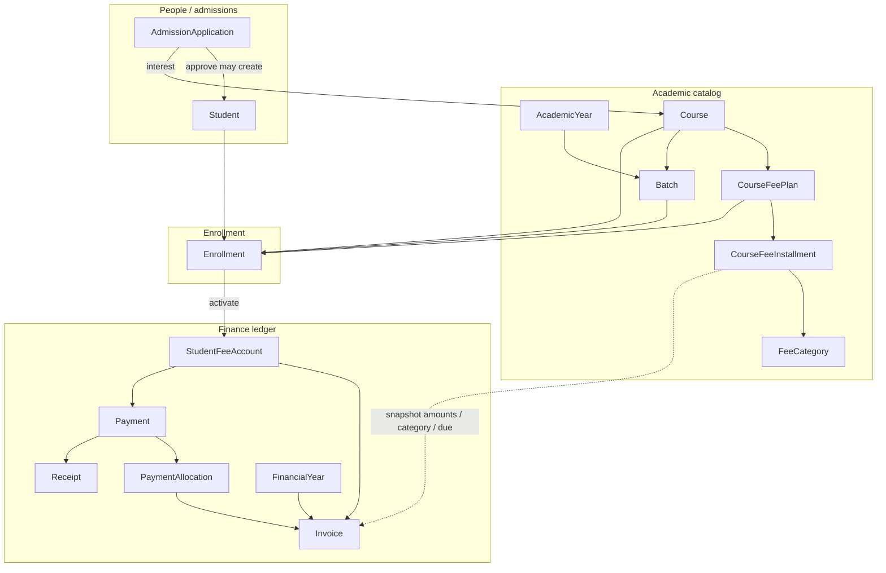

# 12 — Course, fee structure & entity relationships

**Audience:** developers and institute admins implementing / operating academic catalog + fees  
**Status:** Reflects MVP Phase 2 implementation (academic catalog + enrollment activation + finance ledger)  
**Related:** [05-domain-model](./05-domain-model.md), [04-business-rules](./04-business-rules.md) (BR-FI-*, BR-EN-*), [03-functional-requirements](./03-functional-requirements.md) (FR-AC-*, FR-FI-*), [11-mvp steps](./11-mvp-v1-step-by-step-development.md)

---

## 1. Purpose

This document explains how **courses**, **fee structure** (categories, plans, installments), **batches**, **admissions**, **enrollments**, and **finance ledger** entities relate, how they are managed day-to-day, and what is copied vs live-linked when a student is enrolled.

Two layers stay separate on purpose:

| Layer | Module | Role |
| --- | --- | --- |
| **Fee catalog** | `academic` | Defines *what can be charged* for a course (plans + installments) |
| **Fee ledger** | `finance` | Records *what is owed / paid* for a specific enrollment (accounts, invoices, payments) |

> Finance **snapshots** plan amounts at enrollment activation. Later edits to a fee plan do **not** rewrite existing invoices (see §6).

All business rows are tenant-scoped by `institute_id` (ADR 0004).

---

## 2. Big picture



**Reading the diagram**

1. Build catalog: course → fee plan(s) with installments tagged by fee category; batch ties course to an academic year.  
2. Optional admission targets a course; approve creates/links a student.  
3. Enrollment binds **student + batch + fee plan** (course must match batch’s course and plan’s course).  
4. Activate enrollment → fee account + one invoice per installment (snapshot).  
5. Collect payment → allocate to invoices → receipt.

---

## 3. Entity dictionary

### 3.1 Academic catalog

| Entity | Table | Meaning | Managed how |
| --- | --- | --- | --- |
| **Academic year** | `academic_years` | Calendar window for offerings (e.g. 2025–26) | Create from Batches UI (inline); code optional/auto |
| **Fee category** | `fee_categories` | Charge type label (Tuition, Admission, Lab, …) | Create on Course detail when building a plan |
| **Course** | `courses` | Product / programme the institute sells | Courses list → create / view / edit (name, description); code immutable |
| **Course fee plan** | `course_fee_plans` | Priced package for a course (`total_amount`, currency) | Nested under course; one course may have many plans |
| **Fee installment** | `course_fee_installments` | Line within a plan: seq, amount, category, due offset days | Created/replaced with the plan; sum must equal plan total (**BR-FI-01**) |
| **Batch** | `batches` | Runnable offering of a course in an academic year + capacity | Batches list → create / view / edit (name, capacity, status, dates); links course + year |

**Cardinality (catalog)**

```text
Institute 1──* Course
Course 1──* CourseFeePlan
CourseFeePlan 1──* CourseFeeInstallment
FeeCategory 1──* CourseFeeInstallment   (reuse categories across plans)
Course 1──* Batch
AcademicYear 1──* Batch
```

**Immutable after create:** business `code` on course / plan / batch / year / category (use Generate or leave blank for sequence).

### 3.2 People & admissions

| Entity | Table | Relation to catalog |
| --- | --- | --- |
| **Student** | `students` | Person who can enroll; not tied to a fee plan until enrollment |
| **Admission application** | `admission_applications` | References `course_id` (interest). Approve → create/link `student_id`. No fee plan on admission |

Admission is a **workflow** entity (SUBMITTED → APPROVED / REJECTED). It does not own fee structure.

### 3.3 Enrollment

| Entity | Table | Meaning |
| --- | --- | --- |
| **Enrollment** | `enrollments` | Join of student + batch + fee plan (+ denormalized `course_id`) |

Stored foreign ids (logical, no cross-module FKs in DB):

- `student_id` → people  
- `batch_id` → academic batch (implies course + year)  
- `fee_plan_id` → academic fee plan  
- `course_id` → must match batch.course and plan.course  

**Statuses (MVP):** `APPLIED` → `ACTIVE` (via activate). Further statuses (WITHDRAWN, …) are defined in BR-EN-* for later phases.

**Rules enforced at create/activate**

| Rule | Behavior |
| --- | --- |
| BR-EN-02 | No second APPLIED/ACTIVE enrollment for the **same course** for that student |
| Course match | Fee plan’s course must equal batch’s course |
| Capacity | Activate requires batch `OPEN` and active count &lt; capacity |
| BR-EN-05 | Activate creates fee account + invoices **idempotently** |

Enrollment fields (student/batch/plan) are **not editable** after create; use activate (or future transfer/withdraw flows).

### 3.4 Finance ledger

| Entity | Table | Meaning |
| --- | --- | --- |
| **Financial year** | `financial_years` | Books period stamped on invoices |
| **Student fee account** | `student_fee_accounts` | One per enrollment; holds `outstanding_amount` + optimistic `version` |
| **Invoice** | `invoices` | One per plan installment at activation; stores amount, category, due date, `installment_no` |
| **Payment** | `payments` | Money received against a fee account |
| **Payment allocation** | `payment_allocations` | Splits a payment across invoices (default: oldest due first — BR-FI-02) |
| **Receipt** | `receipts` | Issued for each successful payment |

```text
Enrollment 1──1 StudentFeeAccount
StudentFeeAccount 1──* Invoice
StudentFeeAccount 1──* Payment
Payment 1──* PaymentAllocation *──1 Invoice
Payment 1──1 Receipt
```

---

## 4. How fee structure maps onto a course

### 4.1 Intended model

A **course** is the academic product. Money is not attached directly to the course row. Instead:

1. Define **fee categories** once per institute (reusable labels).  
2. Attach one or more **fee plans** to the course (e.g. “Full fee”, “Early bird”, “Installment plan”).  
3. Each plan has a **total_amount** and **installments** that:
   - each reference a **fee category**,
   - each have an **amount** and **due_offset_days** (days after activation),
   - must **sum exactly** to `total_amount` (BR-FI-01).

Example:

| Plan | Total | Installments |
| --- | --- | --- |
| P1 Full | ₹50,000 | 1× Tuition ₹50,000, due +0 days |
| P1 Split | ₹50,000 | Admission ₹5,000 (+0) + Tuition ₹45,000 (+30) |

### 4.2 Batches vs plans

- **Batch** = *when / which cohort* takes the course (year, capacity, OPEN/CLOSED).  
- **Fee plan** = *how much / how split* for that course.  

Enrollment picks **both**: which batch the student joins, and which fee plan applies. Different students in the same batch may use different plans (same course).

### 4.3 Catalog management UI (MVP)

| Step | Where |
| --- | --- |
| Create course | `/courses/new` |
| View course + list plans | `/courses/:id` |
| Edit course name/description | `/courses/:id/edit` |
| Create fee category + fee plan | forms on course detail |
| Edit fee plan / installments | `/fee-plans/:id/edit` |
| Create academic year + batch | `/batches/new` |
| View / edit batch | `/batches/:id`, `/batches/:id/edit` |

---

## 5. End-to-end lifecycle

```text
1. Catalog setup
   Academic year → Course → Fee category(ies) → Fee plan + installments → Batch (course + year)

2. Optional admission
   Application (course) → Approve → Student

3. Enroll
   Create Enrollment(APPLIED): student + batch + fee_plan
   (validates course consistency + BR-EN-02)

4. Activate
   Enrollment → ACTIVE
   Create StudentFeeAccount
   For each installment on the plan:
     create Invoice(amount, fee_category_id, due_date = today + due_offset_days, installment_no)
   Set outstanding ≈ sum(invoice amounts)

5. Collect
   Payment on fee account → allocations to due invoices → Receipt
   Outstanding updated
```

UI paths: `/admissions`, `/enrollments`, `/outstanding`.

---

## 6. Catalog vs ledger (snapshot rule)

| Concern | Source of truth after activation |
| --- | --- |
| Plan name / installment definition | Still in academic catalog (for new enrollments) |
| Amounts owed by this student | **Invoices** on the fee account |
| Outstanding balance | `student_fee_accounts.outstanding_amount` (maintained by finance) |

**Implications**

- Editing a fee plan after students activated under the old plan does **not** auto-adjust their invoices.  
- To change an enrolled student’s charges later, use finance adjustments / new process (future); do not rely on live catalog joins for balance math.  
- Module boundary: academic owns catalog + enrollments; finance owns accounts/invoices/payments (doc 01 §2.2).

---

## 7. What is *not* linked (important negatives)

| Expectation | Actual |
| --- | --- |
| Course has a single fixed fee | No — fees live on **plans**; course can have many plans |
| Batch stores fee amount | No — batch is capacity/schedule; fee comes from enrollment’s **fee_plan_id** |
| Admission creates invoices | No — only **enrollment activate** does (BR-EN-05) |
| Student row stores fee plan | No — only via **enrollment** |
| Cross-module DB foreign keys | Avoided by design (ADR 0002); integrity enforced in application services |

---

## 8. Codes & identity

Sequence-backed codes (optional on create / Generate button): see Phase 2 note in [11](./11-mvp-v1-step-by-step-development.md).

Examples: course `C1-00001`, fee plan `P1-00001`, batch `B1-00001`, fee category `FC1-0001`, student `1000001`.

---

## 9. Quick reference — “where do I change X?”

| Want to… | Change |
| --- | --- |
| Rename a course | Course edit (code stays) |
| Change price for **future** enrollments | Edit fee plan / installments (BR-FI-01 sum) |
| Change price for **already activated** students | Not via plan edit — finance side (future adjustments) |
| Limit seats | Batch capacity / status |
| Put student in a cohort | Enrollment → batch |
| Choose payment schedule | Enrollment → fee plan |
| See money owed | Outstanding / fee account invoices |
| Record cash/UPI | Collect payment on outstanding |

---

## 10. Schema pointers

| Migration | Contents |
| --- | --- |
| `V6__academic_catalog.sql` | years, fee_categories, courses, course_fee_plans, course_fee_installments, batches |
| `V14__batch_faculty_assignments.sql` | subjects, batch_faculty_assignments |
| `V7__admissions.sql` | admission_applications |
| `V8__enrollment_finance.sql` | enrollments, financial_years, student_fee_accounts, invoices, payments, allocations, receipts |
| `V4__people_students.sql` | students (+ guardians/addresses) |

APIs live under `/api/v1/courses`, `/fee-plans`, `/batches`, `/academic-years`, `/fee-categories`, `/enrollments`, finance outstanding/payment endpoints. Faculty teaching assignments: `GET/POST /api/v1/batches/{id}/faculty-assignments` (optional `subjectId`; subjects on `/courses/{id}/subjects`).
