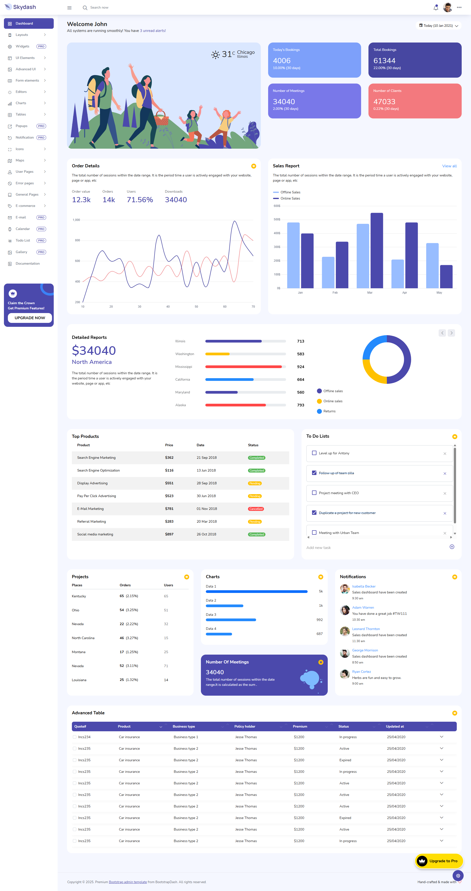

# UI design reference

Primary visual reference for `ims-ui`:

Source file in repo root: `screencapture-demo-bootstrapdash-skydash.png` (BootstrapDash Skydash demo).

## Tokens applied in `ims-ui`

| Token | Value | Usage |
| --- | --- | --- |
| Primary indigo | `#4B49AC` | Active nav, brand |
| Primary light | `#7DA0FA` | Gradients / accents |
| Page background | `#F5F7FB` | Main content |
| Card | white + soft shadow | Widgets/tables |
| Success / warning / danger | soft badge colors | Status pills |

Layout: left sidebar + top header + card-based content; responsive collapse of sidebar under 768px.

Phase 1 checklists:

- [A11y baseline (signed)](./a11y-phase1-checklist.md)
- [Responsive smoke](./responsive-phase1-smoke.md)
- [Mobile device access (LAN / phone)](./mobile-localhost-access.md)
- Design system demo route in UI: `/design-system`

